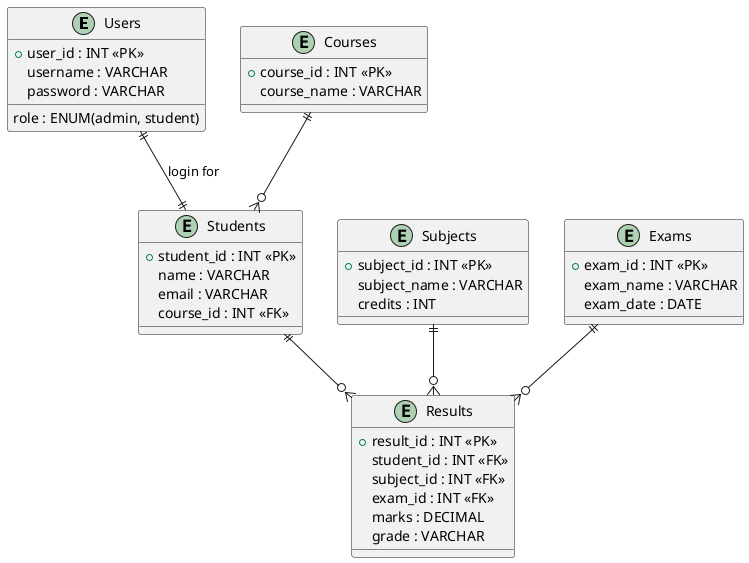

Good approach—**database first = high marks** 💯
Let’s do this properly step by step.

---

# 🧠 1. Final Database Design (Before ER)

We’ll design a **complete, normalized Student Result System** (≥ 5 tables + relationships).

## ✅ Main Entities

- Users (login system)
- Students
- Subjects
- Exams
- Results
- Courses (optional but good for normalization)

---

# 📐 2. ER Diagram (PlantUML Code)

👉 You can paste this into **PlantUML Online** or VS Code extension.



---

# 🧩 3. ER Explanation (For Your PDF)

- One **Course** → many Students
- One **Student** → many Results
- One **Subject** → many Results
- One **Exam** → many Results
- One **User** ↔ one Student (optional mapping)

👉 This satisfies **relational design + normalization**

---

# 🗄️ 4. MySQL Database Creation (FULL SCRIPT)

## 🔹 Step 1: Create Database

```sql
CREATE DATABASE student_result_system;
USE student_result_system;
```

---

## 🔹 Step 2: Create Tables

### ✅ 1. Courses

```sql
CREATE TABLE courses (
    course_id INT AUTO_INCREMENT PRIMARY KEY,
    course_name VARCHAR(100) NOT NULL
);
```

---

### ✅ 2. Students

```sql
CREATE TABLE students (
    student_id INT AUTO_INCREMENT PRIMARY KEY,
    name VARCHAR(100) NOT NULL,
    email VARCHAR(100) UNIQUE,
    course_id INT,
    FOREIGN KEY (course_id) REFERENCES courses(course_id)
);
```

---

### ✅ 3. Subjects

```sql
CREATE TABLE subjects (
    subject_id INT AUTO_INCREMENT PRIMARY KEY,
    subject_name VARCHAR(100) NOT NULL,
    credits INT NOT NULL
);
```

---

### ✅ 4. Exams

```sql
CREATE TABLE exams (
    exam_id INT AUTO_INCREMENT PRIMARY KEY,
    exam_name VARCHAR(100),
    exam_date DATE
);
```

---

### ✅ 5. Users

```sql
CREATE TABLE users (
    user_id INT AUTO_INCREMENT PRIMARY KEY,
    username VARCHAR(50) UNIQUE,
    password VARCHAR(255),
    role ENUM('admin','student') NOT NULL,
    student_id INT,
    FOREIGN KEY (student_id) REFERENCES students(student_id)
);
```

---

### ✅ 6. Results

```sql
CREATE TABLE results (
    result_id INT AUTO_INCREMENT PRIMARY KEY,
    student_id INT,
    subject_id INT,
    exam_id INT,
    marks DECIMAL(5,2),
    grade VARCHAR(2),

    FOREIGN KEY (student_id) REFERENCES students(student_id),
    FOREIGN KEY (subject_id) REFERENCES subjects(subject_id),
    FOREIGN KEY (exam_id) REFERENCES exams(exam_id)
);
```

---

# 🔐 5. Add Constraints & Indexes

```sql
CREATE INDEX idx_student ON results(student_id);
CREATE INDEX idx_subject ON results(subject_id);
```

---

# ⚙️ 6. Stored Procedures (REQUIRED ≥ 3)

### ✅ 1. Get Student Results

```sql
DELIMITER //

CREATE PROCEDURE GetStudentResults(IN sid INT)
BEGIN
    SELECT s.name, sub.subject_name, r.marks, r.grade
    FROM results r
    JOIN students s ON r.student_id = s.student_id
    JOIN subjects sub ON r.subject_id = sub.subject_id
    WHERE s.student_id = sid;
END //

DELIMITER ;
```

---

### ✅ 2. Insert Result

```sql
DELIMITER //

CREATE PROCEDURE AddResult(
    IN sid INT,
    IN subid INT,
    IN eid INT,
    IN marks DECIMAL(5,2)
)
BEGIN
    INSERT INTO results(student_id, subject_id, exam_id, marks)
    VALUES(sid, subid, eid, marks);
END //

DELIMITER ;
```

---

### ✅ 3. Calculate Average

```sql
DELIMITER //

CREATE PROCEDURE GetAverage(IN sid INT)
BEGIN
    SELECT AVG(marks) AS average_marks
    FROM results
    WHERE student_id = sid;
END //

DELIMITER ;
```

---

# ⚡ 7. Triggers (REQUIRED ≥ 2)

### ✅ Grade Calculation Trigger

```sql
DELIMITER //

CREATE TRIGGER before_insert_result
BEFORE INSERT ON results
FOR EACH ROW
BEGIN
    IF NEW.marks >= 75 THEN
        SET NEW.grade = 'A';
    ELSEIF NEW.marks >= 65 THEN
        SET NEW.grade = 'B';
    ELSEIF NEW.marks >= 50 THEN
        SET NEW.grade = 'C';
    ELSE
        SET NEW.grade = 'F';
    END IF;
END //

DELIMITER ;
```

---

### ✅ Update Trigger

```sql
DELIMITER //

CREATE TRIGGER before_update_result
BEFORE UPDATE ON results
FOR EACH ROW
BEGIN
    IF NEW.marks >= 75 THEN
        SET NEW.grade = 'A';
    ELSEIF NEW.marks >= 50 THEN
        SET NEW.grade = 'C';
    ELSE
        SET NEW.grade = 'F';
    END IF;
END //

DELIMITER ;
```

---

# 👁️ 8. Views (REQUIRED ≥ 2)

### ✅ Student Summary

```sql
CREATE VIEW student_summary AS
SELECT student_id, AVG(marks) AS avg_marks
FROM results
GROUP BY student_id;
```

---

### ✅ Top Students

```sql
CREATE VIEW top_students AS
SELECT s.name, AVG(r.marks) AS avg_marks
FROM results r
JOIN students s ON r.student_id = s.student_id
GROUP BY r.student_id
ORDER BY avg_marks DESC;
```

---

# 🔄 9. Transaction Example

```sql
START TRANSACTION;

INSERT INTO results(student_id, subject_id, exam_id, marks)
VALUES (1, 1, 1, 80);

UPDATE students SET name = 'Updated Name' WHERE student_id = 1;

COMMIT;
```

---

# 🧪 10. Sample Data (IMPORTANT for demo)

```sql
INSERT INTO courses (course_name) VALUES ('IT'), ('Business');

INSERT INTO students (name, email, course_id)
VALUES ('Sanjay', 'sanjay@gmail.com', 1);

INSERT INTO subjects (subject_name, credits)
VALUES ('Database', 3), ('Programming', 4);

INSERT INTO exams (exam_name, exam_date)
VALUES ('Mid Exam', '2026-05-01');
```

---

# ✅ What You Have Now

✔ ER Diagram (PlantUML)
✔ Fully normalized database
✔ All tables + relationships
✔ Stored procedures
✔ Triggers
✔ Views
✔ Indexes
✔ Transaction

👉 This already covers **~60%+ marks** 🔥

---

# 🚀 Next Step

If you want, I can:

- ✔ Convert ER diagram into **image (for PDF)**
- ✔ Create **schema.sql file ready**
- ✔ Help you **connect PHP (PDO)**
- ✔ Build **full CRUD system**

Just tell me 👍
